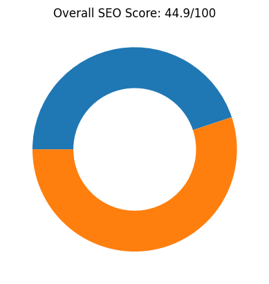
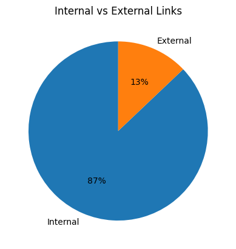
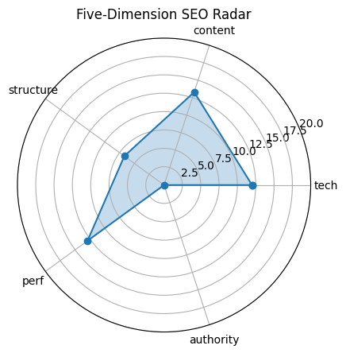

# 🏆 SEO Audit Report – https://www.maxai.co/

> **扫描时间** 2025-05-19 15:42:55 | **总分** `44.9` / 100  
> 核心结论：The website has a low overall SEO score of 44.9, with particularly poor performance in structure and authority, despite having good meta tags and social media integration.

---

## 1. 总览

| 维度 | 得分 |
|------|------|
| tech | `12.0` |
| content | `13.3` |
| structure | `6.7` |
| perf | `12.9` |
| authority | `0` |

---

## 2. 技术合规 (20)

| 指标 | 实测 |
|------|------|
| HTTP 状态 | `200` |
| HSTS | `False` |
| CSP | `False` |
| robots.txt | `200` |
| Sitemap | `1` |

---

## 3. 页面内容 (20)

| 指标 | 实测 |
|------|------|
| H1 Count | `1` |
| H2 Count | `10` |
| H3 Count | `16` |
| Missing Alt Images | `0` |
| Text Ratio (%) | `1.76` |

---

## 4. 结构 & 可访问性 (20)

| 指标 | 实测 |
|------|------|
| Internal Links | `81` |
| External Links | `12` |
| Nav Links | `0` |
| Schema Types | `` |

  

---

## 5. 性能 & 体验 (20)

| 指标 | 实测 |
|------|------|
| LCP | `2.67` |
| FID/INP | `8412.52` |
| CLS | `0.0011561186687115254` |
| TTFB | `None` |

---

## 6. 权威 & 语义 (20)

| 指标 | 实测 |
|------|------|
| Structured Data Count | `77` |
| Tech Stack | `` |

---

## 7. 细节

首段正文

`MaxAI`

Quick Tips

- ⚠️ 文字占比 1.76%（疑似 CSR）

---

## 8. LLM 建议

Improve the site structure by organizing headings more logically and reducing the number of H3 tags to enhance readability and SEO.

Increase the text-to-HTML ratio significantly from the current 1.76% to improve content richness and search engine visibility.

Enhance authority by acquiring backlinks from reputable sources and possibly adding more detailed, authoritative content.

Implement structured data (schema markup) to help search engines better understand and display the site's content in search results.

Ensure all security headers like HSTS and CSP are properly configured to improve site security and trustworthiness.
