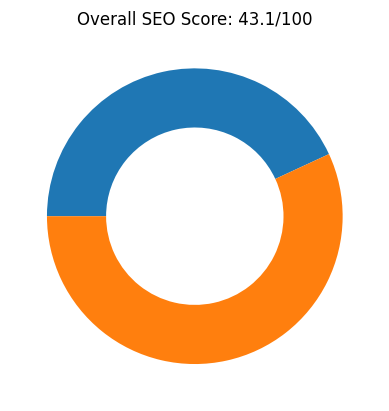
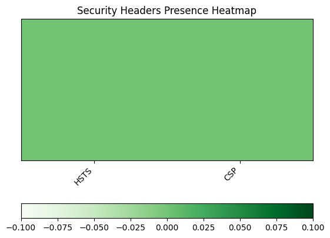
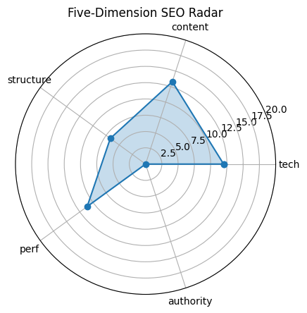

# 🏆 SEO Audit Report – https://www.maxai.co/

> **扫描时间** 2025-05-20 14:49:17 | **总分** `43.1` / 100  
> 核心结论：The MaxAI website has a low overall SEO score of 43.1, with particularly weak areas in structure and authority, despite having good technical and content elements.

---

## 1. 总览

| 维度 | 得分 |
|------|------|
| tech | `12.0` |
| content | `13.3` |
| structure | `6.7` |
| perf | `11.1` |
| authority | `0` |

---

## 2. 技术合规 (20)

| 指标 | 实测 |
|------|------|
| HTTP 状态 | `200` |
| HSTS | `False` |
| CSP | `False` |
| robots.txt | `200` |
| Sitemap | `1` |

---

## 3. 页面内容 (20)

| 指标 | 实测 |
|------|------|
| H1 Count | `1` |
| H2 Count | `10` |
| H3 Count | `16` |
| Missing Alt Images | `0` |
| Text Ratio (%) | `1.76` |

---

## 4. 结构 & 可访问性 (20)

| 指标 | 实测 |
|------|------|
| Internal Links | `81` |
| External Links | `12` |
| Nav Links | `0` |
| Schema Types | `` |

  

---

## 5. 性能 & 体验 (20)

| 指标 | 实测 |
|------|------|
| LCP | `3.34` |
| FID/INP | `8368.19` |
| CLS | `0.0016553871080053496` |
| TTFB | `None` |

---

## 6. 权威 & 语义 (20)

| 指标 | 实测 |
|------|------|
| Structured Data Count | `77` |
| Tech Stack | `` |

---

## 7. 细节

首段正文

`MaxAI`

Quick Tips

- ⚠️ 文字占比 1.76%（疑似 CSR）

---

## 8. LLM 建议

Improve the website's structure by organizing headings more logically and reducing the number of H3 tags to enhance readability and SEO performance.

Increase the site's authority by acquiring high-quality backlinks and engaging in content marketing strategies to boost credibility and search rankings.

Enhance the text ratio and word count to provide more detailed content, which can improve engagement and SEO metrics.

Implement structured data (schema markup) to help search engines better understand the content and improve visibility in search results.

Ensure all security headers like HSTS and CSP are properly configured to protect the site and improve trust signals for SEO.
