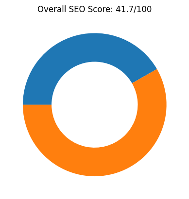
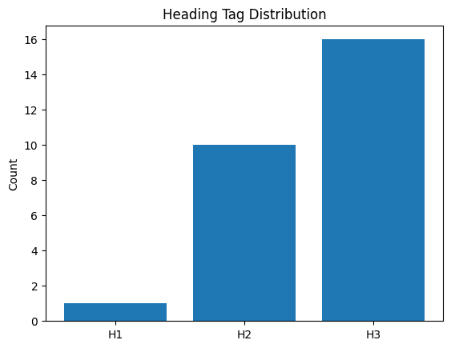
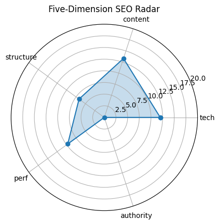

# 🏆 SEO Audit Report – https://www.maxai.co/

> **扫描时间** 2025-05-20 15:28:41 | **总分** `41.7` / 100  
> 核心结论：The MaxAI webpage has a low overall SEO score of 41.7, with particularly weak areas in technical SEO, content, and authority, despite having well-optimized meta tags and social media elements.

---

## 1. 总览

| 维度 | 得分 |
|------|------|
| tech | `12.0` |
| content | `13.3` |
| structure | `6.7` |
| perf | `9.7` |
| authority | `0` |

---

## 2. 技术合规 (20)

| 指标 | 实测 |
|------|------|
| HTTP 状态 | `200` |
| HSTS | `False` |
| CSP | `False` |
| robots.txt | `200` |
| Sitemap | `1` |

---

## 3. 页面内容 (20)

| 指标 | 实测 |
|------|------|
| H1 Count | `1` |
| H2 Count | `10` |
| H3 Count | `16` |
| Missing Alt Images | `0` |
| Text Ratio (%) | `1.76` |

---

## 4. 结构 & 可访问性 (20)

| 指标 | 实测 |
|------|------|
| Internal Links | `81` |
| External Links | `12` |
| Nav Links | `0` |
| Schema Types | `` |

  

---

## 5. 性能 & 体验 (20)

| 指标 | 实测 |
|------|------|
| LCP | `3.86` |
| FID/INP | `9988.81` |
| CLS | `0.0016553871080053496` |
| TTFB | `None` |

---

## 6. 权威 & 语义 (20)

| 指标 | 实测 |
|------|------|
| Structured Data Count | `77` |
| Tech Stack | `` |

---

## 7. 细节

首段正文

`MaxAI`

Quick Tips

- ⚠️ 文字占比 1.76%（疑似 CSR）

---

## 8. LLM 建议

Improve technical SEO by addressing issues like low text ratio (1.76%) and optimizing the site structure for better crawlability.

Enhance content quality by increasing the word count and ensuring the content is more informative and engaging to boost the content score.

Build backlinks and establish domain authority through guest blogging, partnerships, and high-quality content to improve the authority score.

Optimize the site's performance by reducing load times and improving server response times to enhance user experience and SEO.

Ensure all structured data is correctly implemented and includes relevant schema types to improve search engine understanding and visibility.
