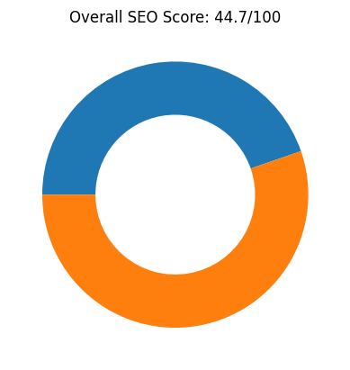
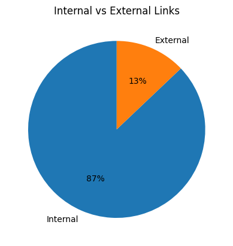
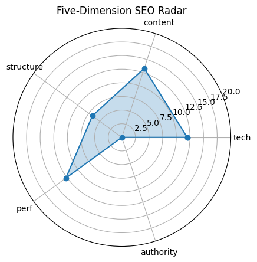

# 🏆 SEO Audit Report – https://www.maxai.co/

> **扫描时间** 2025-05-20 15:35:34 | **总分** `44.7` / 100  
> 核心结论：The MaxAI webpage has a low overall SEO score of 44.7, with particularly poor performance in structure and authority, but shows some strengths in content and performance.

---

## 1. 总览

| 维度 | 得分 |
|------|------|
| tech | `12.0` |
| content | `13.3` |
| structure | `6.7` |
| perf | `12.7` |
| authority | `0` |

---

## 2. 技术合规 (20)

| 指标 | 实测 |
|------|------|
| HTTP 状态 | `200` |
| HSTS | `False` |
| CSP | `False` |
| robots.txt | `200` |
| Sitemap | `1` |

---

## 3. 页面内容 (20)

| 指标 | 实测 |
|------|------|
| H1 Count | `1` |
| H2 Count | `10` |
| H3 Count | `16` |
| Missing Alt Images | `0` |
| Text Ratio (%) | `1.76` |

---

## 4. 结构 & 可访问性 (20)

| 指标 | 实测 |
|------|------|
| Internal Links | `81` |
| External Links | `12` |
| Nav Links | `0` |
| Schema Types | `` |

  

---

## 5. 性能 & 体验 (20)

| 指标 | 实测 |
|------|------|
| LCP | `2.72` |
| FID/INP | `8523.58` |
| CLS | `0.0011561186687115254` |
| TTFB | `None` |

---

## 6. 权威 & 语义 (20)

| 指标 | 实测 |
|------|------|
| Structured Data Count | `77` |
| Tech Stack | `` |

---

## 7. 细节

首段正文

`MaxAI`

Quick Tips

- ⚠️ 文字占比 1.76%（疑似 CSR）

---

## 8. LLM 建议

Improve the site's structure by organizing headings more logically and reducing the number of H3 tags to enhance readability and SEO.

Enhance authority by acquiring backlinks from reputable sources and possibly adding testimonials or case studies from recognized businesses or universities.

Increase the text ratio by adding more informative content to the page, as the current text ratio is very low at 1.76%.

Implement structured data (schema markup) to help search engines better understand the content and improve visibility in search results.

Ensure all social tags and meta descriptions are optimized for engagement and accurately reflect the page content to improve click-through rates.
