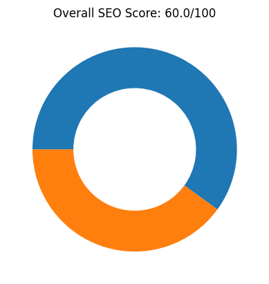
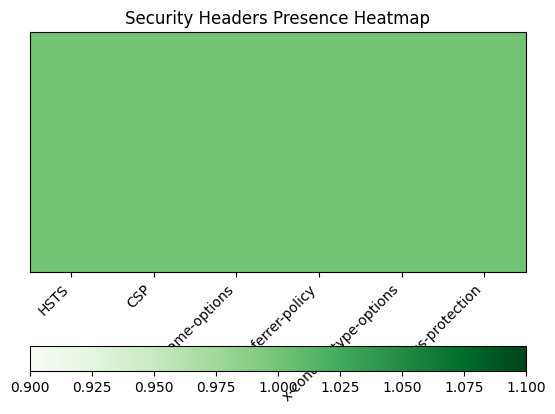
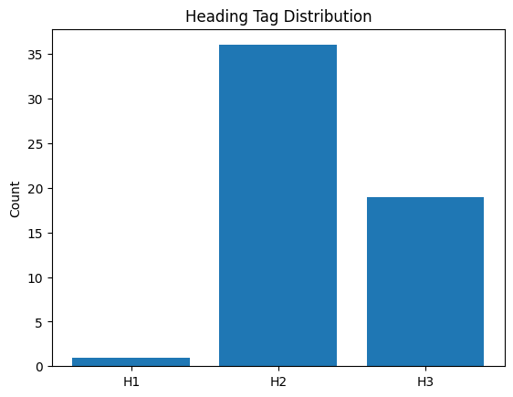
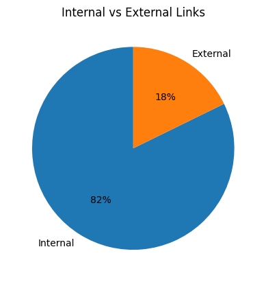
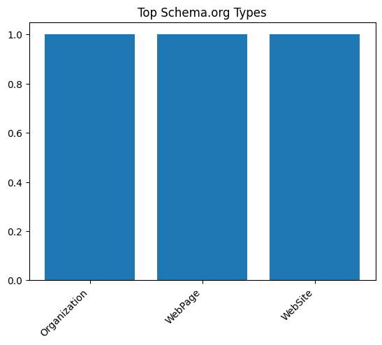
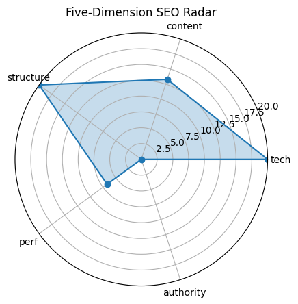

# 🏆 SEO Audit Report – https://www.apple.com/

> **扫描时间** 2025-05-20 20:54:44 | **总分** `60.0` / 100  
> 核心结论：Apple's homepage has strong technical foundations and structure but lacks in content depth and performance optimization.

---

## 1. 总览

| 维度 | 得分 |
|------|------|
| tech | `20.0` |
| content | `13.3` |
| structure | `20.0` |
| perf | `6.7` |
| authority | `0` |

---

## 2. 技术合规 (20)

| 指标 | 实测 |
|------|------|
| HTTP 状态 | `200` |
| HSTS | `True` |
| CSP | `True` |
| robots.txt | `200` |
| Sitemap | `5` |

---

## 3. 页面内容 (20)

| 指标 | 实测 |
|------|------|
| H1 Count | `1` |
| H2 Count | `36` |
| H3 Count | `19` |
| Missing Alt Images | `0` |
| Text Ratio (%) | `3.28` |

---

## 4. 结构 & 可访问性 (20)

| 指标 | 实测 |
|------|------|
| Internal Links | `273` |
| External Links | `59` |
| Nav Links | `197` |
| Schema Types | `Organization, WebPage, WebSite` |

  

---

## 5. 性能 & 体验 (20)

| 指标 | 实测 |
|------|------|
| LCP | `18.59` |
| FID/INP | `19165.11` |
| CLS | `0` |
| TTFB | `None` |

---

## 6. 权威 & 语义 (20)

| 指标 | 实测 |
|------|------|
| Structured Data Count | `129` |
| Tech Stack | `Cart Functionality` |

---

## 7. 细节

首段正文

`Thinstant classic.`

Quick Tips

- ⚠️ 文字占比 3.28%（疑似 CSR）

---

## 8. LLM 建议

Improve content depth and relevance to enhance the content score.

Optimize performance metrics to improve page load times and user experience.

Increase authority signals such as backlinks and social shares to boost the authority score.

Ensure all headings (H2, H3) are semantically structured for better readability and SEO.

Monitor and refine internal linking strategies to improve navigation and crawlability.
