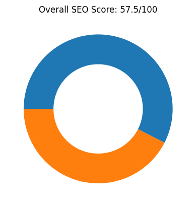
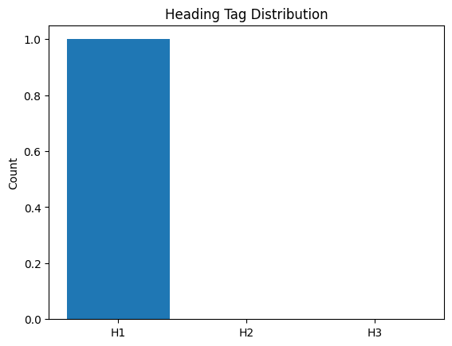
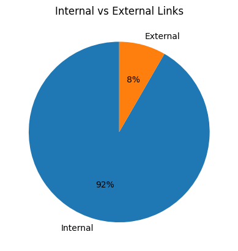
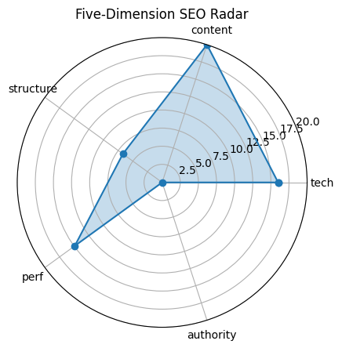

# 🏆 SEO Audit Report – https://y2mate.nu/en-sDNs/

> **扫描时间** 2025-05-20 21:16:54 | **总分** `57.5` / 100  
> 核心结论：该网站整体SEO评分为57.5分，技术、内容和性能表现尚可，但结构和权威性方面存在明显不足。

---

## 1. 总览

| 维度 | 得分 |
|------|------|
| tech | `16.0` |
| content | `20.0` |
| structure | `6.7` |
| perf | `14.9` |
| authority | `0` |

---

## 2. 技术合规 (20)

| 指标 | 实测 |
|------|------|
| HTTP 状态 | `200` |
| HSTS | `False` |
| CSP | `True` |
| robots.txt | `200` |
| Sitemap | `1` |

---

## 3. 页面内容 (20)

| 指标 | 实测 |
|------|------|
| H1 Count | `1` |
| H2 Count | `0` |
| H3 Count | `0` |
| Missing Alt Images | `0` |
| Text Ratio (%) | `23.03` |

---

## 4. 结构 & 可访问性 (20)

| 指标 | 实测 |
|------|------|
| Internal Links | `11` |
| External Links | `1` |
| Nav Links | `0` |
| Schema Types | `` |

  

---

## 5. 性能 & 体验 (20)

| 指标 | 实测 |
|------|------|
| LCP | `0.81` |
| FID/INP | `814.00` |
| CLS | `0` |
| TTFB | `None` |

---

## 6. 权威 & 语义 (20)

| 指标 | 实测 |
|------|------|
| Structured Data Count | `0` |
| Tech Stack | `` |

---

## 7. 细节

首段正文

`Our YouTube to MP3 Converter allows you to convert your favorite YouTube videos to MP3 (audio) or MP4 (video) files and to download them for FREE.Y2Mateworks on your desktop, tablet and mobile device without the installation of any additional apps. The usage of Y2Mate is free, and safe!`

Quick Tips

- ⚠️ 未检测 canonical

---

## 8. LLM 建议

增加H2和H3标题以改善内容结构，提升可读性和SEO效果。

添加规范URL（canonical）和hreflang标签，以解决重复内容和多语言问题。

丰富结构化数据（schema markup），提升搜索引擎对内容的理解和展示效果。

增加外部链接以提高网站权威性，并考虑获取高质量的反向链接。

优化robots.txt文件，确保搜索引擎能正确抓取重要页面，同时屏蔽敏感或重复内容。
