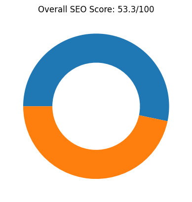
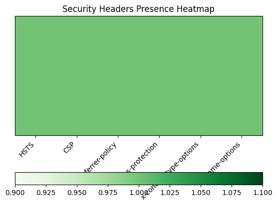
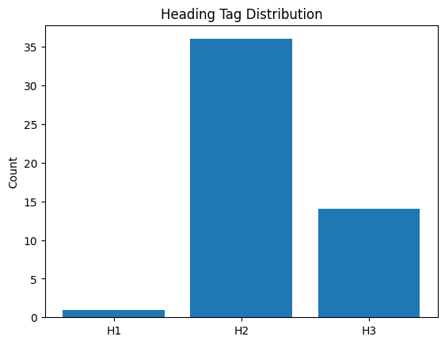
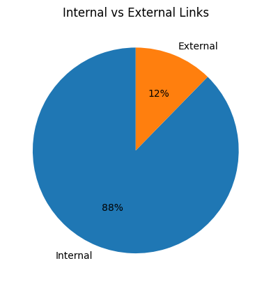
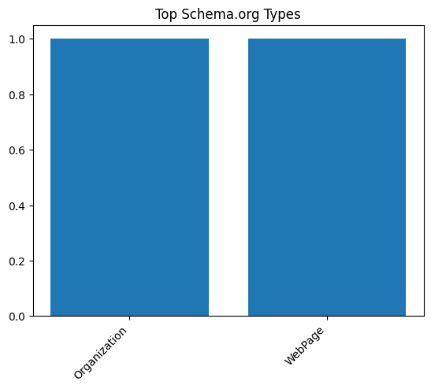
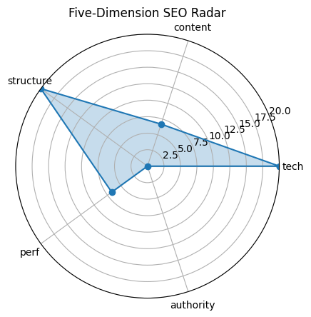

# 🏆 SEO Audit Report – https://www.apple.com.cn/

> **扫描时间** 2025-05-20 21:45:34 | **总分** `53.3` / 100  
> 核心结论：Apple 中国官网在技术和结构方面表现良好，但在内容、性能和权威性方面有待提升。

---

## 1. 总览

| 维度 | 得分 |
|------|------|
| tech | `20.0` |
| content | `6.7` |
| structure | `20.0` |
| perf | `6.7` |
| authority | `0` |

---

## 2. 技术合规 (20)

| 指标 | 实测 |
|------|------|
| HTTP 状态 | `200` |
| HSTS | `True` |
| CSP | `True` |
| robots.txt | `200` |
| Sitemap | `5` |

---

## 3. 页面内容 (20)

| 指标 | 实测 |
|------|------|
| H1 Count | `1` |
| H2 Count | `36` |
| H3 Count | `14` |
| Missing Alt Images | `1` |
| Text Ratio (%) | `1.97` |

---

## 4. 结构 & 可访问性 (20)

| 指标 | 实测 |
|------|------|
| Internal Links | `228` |
| External Links | `32` |
| Nav Links | `159` |
| Schema Types | `Organization, WebPage` |

  

---

## 5. 性能 & 体验 (20)

| 指标 | 实测 |
|------|------|
| LCP | `15.60` |
| FID/INP | `15603.22` |
| CLS | `0` |
| TTFB | `None` |

---

## 6. 权威 & 语义 (20)

| 指标 | 实测 |
|------|------|
| Structured Data Count | `76` |
| Tech Stack | `Cart Functionality` |

---

## 7. 细节

首段正文

`薄爆表`

Quick Tips

- ⚠️ 文字占比 1.97%（疑似 CSR）

---

## 8. LLM 建议

优化内容质量，增加原创和有价值的信息，提升内容评分。

提高页面加载速度，优化性能指标，改善用户体验。

增加外部权威链接和引用，提升网站的权威性和可信度。

确保所有图片都有 alt 属性，以提升可访问性和 SEO 表现。

考虑增加更多结构化数据，如 BreadcrumbList 或 Product，以丰富搜索结果展示。
