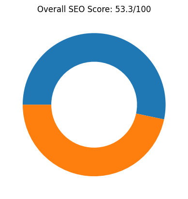
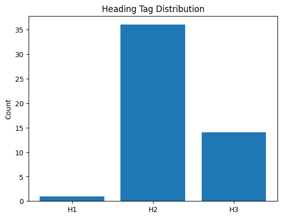
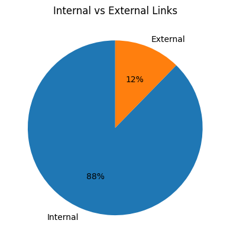
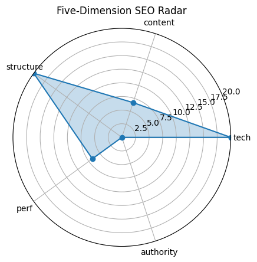

# 🏆 SEO Audit Report – https://www.apple.com.cn/

> **扫描时间** 2025-05-20 21:50:55 | **总分** `53.3` / 100  
> 核心结论：Apple 中国官网 SEO 表现中等，技术基础良好但内容优化和权威性不足。

---

## 1. 总览

| 维度 | 得分 |
|------|------|
| tech | `20.0` |
| content | `6.7` |
| structure | `20.0` |
| perf | `6.7` |
| authority | `0` |

---

## 2. 技术合规 (20)

| 指标 | 实测 |
|------|------|
| HTTP 状态 | `200` |
| HSTS | `True` |
| CSP | `True` |
| robots.txt | `200` |
| Sitemap | `5` |

---

## 3. 页面内容 (20)

| 指标 | 实测 |
|------|------|
| H1 Count | `1` |
| H2 Count | `36` |
| H3 Count | `14` |
| Missing Alt Images | `1` |
| Text Ratio (%) | `1.97` |

---

## 4. 结构 & 可访问性 (20)

| 指标 | 实测 |
|------|------|
| Internal Links | `228` |
| External Links | `32` |
| Nav Links | `159` |
| Schema Types | `Organization, WebPage` |

  

---

## 5. 性能 & 体验 (20)

| 指标 | 实测 |
|------|------|
| LCP | `15.56` |
| FID/INP | `15570.73` |
| CLS | `5.3037067199721835e-05` |
| TTFB | `None` |

---

## 6. 权威 & 语义 (20)

| 指标 | 实测 |
|------|------|
| Structured Data Count | `76` |
| Tech Stack | `Cart Functionality` |

---

## 7. 细节

首段正文

`薄爆表`

Quick Tips

- ⚠️ 文字占比 1.97%（疑似 CSR）

---

## 8. LLM 建议

增加页面内容深度和关键词优化，提升内容质量得分。

优化图片 alt 属性，确保所有图片都有描述性文本。

加强内部链接结构，减少重复内容，提升用户体验。

提升页面加载速度，改善性能得分。

增加高质量外部链接和社交媒体互动，提升权威性得分。
