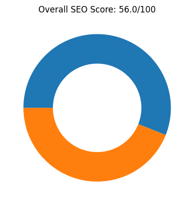
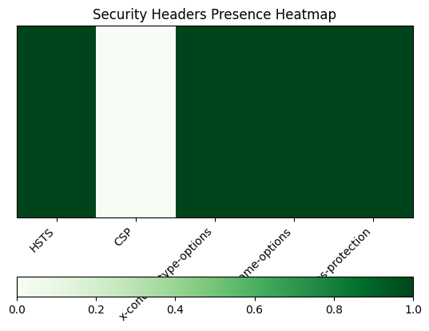
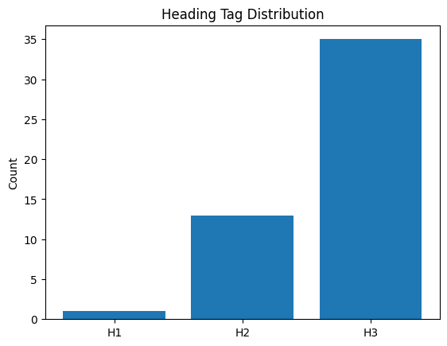
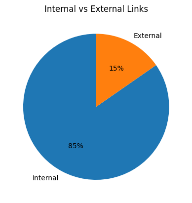
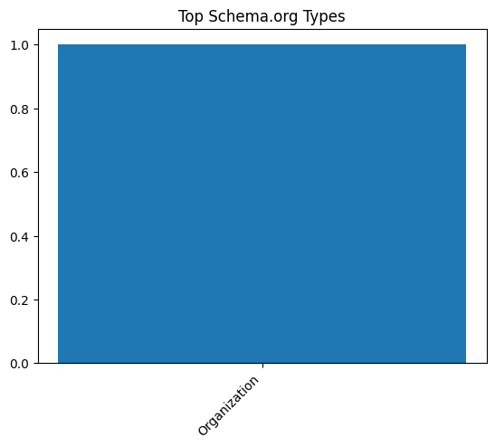
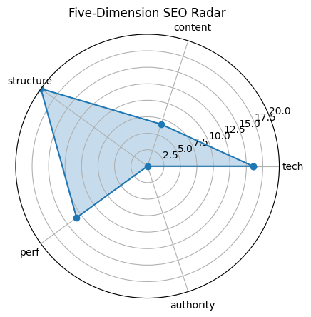

# 🏆 SEO Audit Report – https://www.coursera.org/

> **扫描时间** 2025-05-20 21:56:27 | **总分** `56.0` / 100  
> 核心结论：The Coursera website has a moderate SEO score of 56, with strengths in structure but weaknesses in content and technical SEO, particularly in missing alt attributes for images and low text ratio.

---

## 1. 总览

| 维度 | 得分 |
|------|------|
| tech | `16.0` |
| content | `6.7` |
| structure | `20.0` |
| perf | `13.3` |
| authority | `0` |

---

## 2. 技术合规 (20)

| 指标 | 实测 |
|------|------|
| HTTP 状态 | `200` |
| HSTS | `True` |
| CSP | `False` |
| robots.txt | `200` |
| Sitemap | `1` |

---

## 3. 页面内容 (20)

| 指标 | 实测 |
|------|------|
| H1 Count | `1` |
| H2 Count | `13` |
| H3 Count | `35` |
| Missing Alt Images | `57` |
| Text Ratio (%) | `1.3` |

---

## 4. 结构 & 可访问性 (20)

| 指标 | 实测 |
|------|------|
| Internal Links | `138` |
| External Links | `25` |
| Nav Links | `8` |
| Schema Types | `Organization` |

  

---

## 5. 性能 & 体验 (20)

| 指标 | 实测 |
|------|------|
| LCP | `2.20` |
| FID/INP | `10400.48` |
| CLS | `0.018577787338421407` |
| TTFB | `None` |

---

## 6. 权威 & 语义 (20)

| 指标 | 实测 |
|------|------|
| Structured Data Count | `111` |
| Tech Stack | `Contentful, Google Sign-in, React` |

---

## 7. 细节

首段正文

`Start, switch, or advance your career with more than 10,000 courses, Professional Certificates, and degrees from world-class universities and companies.`

Quick Tips

- ⚠️ 文字占比 1.3%（疑似 CSR）

---

## 8. LLM 建议

Improve the content score by increasing the text-to-HTML ratio and ensuring the content is more comprehensive and keyword-rich.

Add alt attributes to the 57 images currently missing them to enhance accessibility and image SEO.

Enhance technical SEO by addressing the low performance score, possibly through optimizing page speed and ensuring mobile responsiveness.

Increase the authority score by building more high-quality backlinks and improving social media integration and engagement.

Consider reducing the number of H3 tags (currently 35) to improve content hierarchy and readability.
