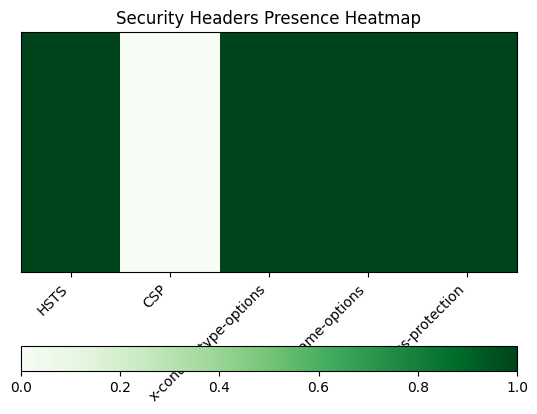
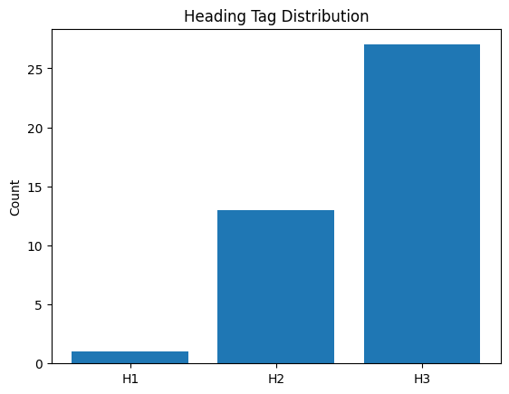
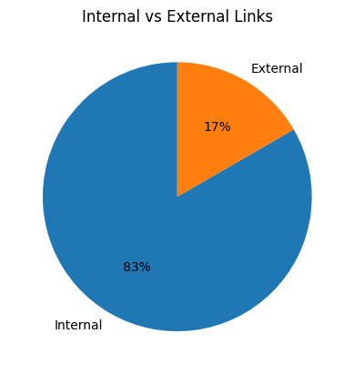
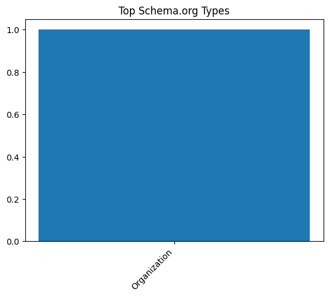
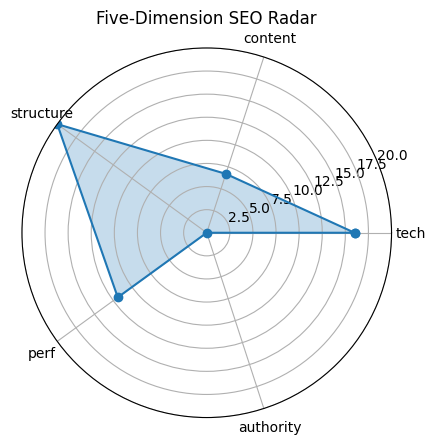

# 🏆 SEO Audit Report – https://www.coursera.org/

> **扫描时间** 2025-05-20 21:59:26 | **总分** `54.6` / 100  
> 核心结论：The Coursera website has moderate SEO performance with strengths in technical structure but needs significant improvements in content quality and authority.

---

## 1. 总览

| 维度 | 得分 |
|------|------|
| tech | `16.0` |
| content | `6.7` |
| structure | `20.0` |
| perf | `11.9` |
| authority | `0` |

---

## 2. 技术合规 (20)

| 指标 | 实测 |
|------|------|
| HTTP 状态 | `200` |
| HSTS | `True` |
| CSP | `False` |
| robots.txt | `200` |
| Sitemap | `1` |

---

## 3. 页面内容 (20)

| 指标 | 实测 |
|------|------|
| H1 Count | `1` |
| H2 Count | `13` |
| H3 Count | `27` |
| Missing Alt Images | `51` |
| Text Ratio (%) | `1.08` |

---

## 4. 结构 & 可访问性 (20)

| 指标 | 实测 |
|------|------|
| Internal Links | `125` |
| External Links | `25` |
| Nav Links | `8` |
| Schema Types | `Organization` |

  

---

## 5. 性能 & 体验 (20)

| 指标 | 实测 |
|------|------|
| LCP | `3.02` |
| FID/INP | `10326.40` |
| CLS | `0.018577787338421407` |
| TTFB | `None` |

---

## 6. 权威 & 语义 (20)

| 指标 | 实测 |
|------|------|
| Structured Data Count | `111` |
| Tech Stack | `Contentful, Google Sign-in, React` |

---

## 7. 细节

首段正文

`Start, switch, or advance your career with more than 10,000 courses, Professional Certificates, and degrees from world-class universities and companies.`

Quick Tips

- ⚠️ 文字占比 1.08%（疑似 CSR）

---

## 8. LLM 建议

Improve content quality by increasing text ratio and ensuring headings are more descriptive and relevant to the page's focus.

Add alt text to the 51 missing alt attributes on images to enhance accessibility and SEO.

Enhance authority by building more backlinks and possibly adding more structured data types beyond just 'Organization'.

Optimize the meta description and title tags to better reflect the diverse offerings and target more specific keywords.

Consider reducing the number of H3 tags (currently 27) to improve content hierarchy and focus.
