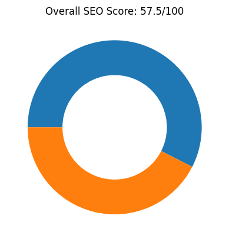
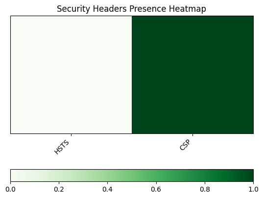
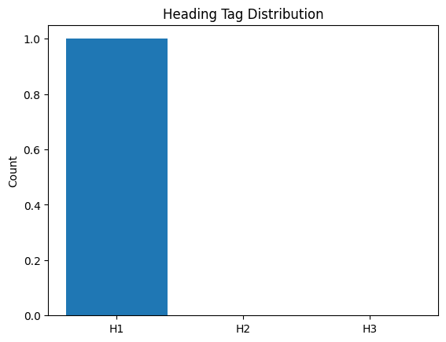
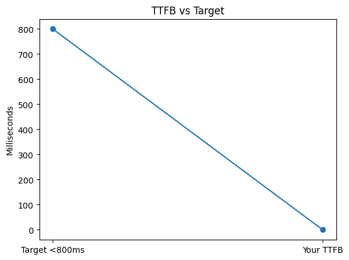
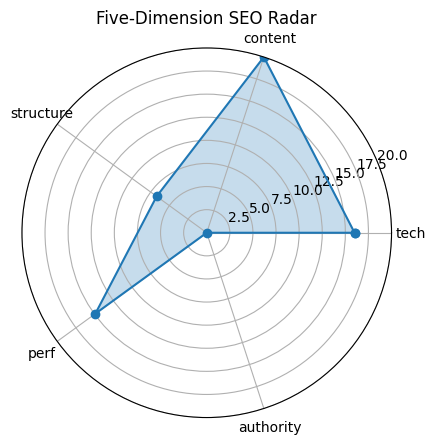

# 🏆 SEO Audit Report – https://y2mate.nu/en-sDNs/

> **扫描时间** 2025-05-21 10:06:34 | **总分** `57.5` / 100  
> 核心结论：The website has a moderate SEO score of 57.5, with strengths in content but weaknesses in structure and authority.

---

## 1. 总览

| 维度 | 得分 |
|------|------|
| tech | `16.0` |
| content | `20.0` |
| structure | `6.7` |
| perf | `14.9` |
| authority | `0` |

---

## 2. 技术合规 (20)

| 指标 | 实测 |
|------|------|
| HTTP 状态 | `200` |
| HSTS | `False` |
| CSP | `True` |
| robots.txt | `200` |
| Sitemap | `1` |

---

## 3. 页面内容 (20)

| 指标 | 实测 |
|------|------|
| H1 Count | `1` |
| H2 Count | `0` |
| H3 Count | `0` |
| Missing Alt Images | `0` |
| Text Ratio (%) | `22.65` |

---

## 4. 结构 & 可访问性 (20)

| 指标 | 实测 |
|------|------|
| Internal Links | `11` |
| External Links | `1` |
| Nav Links | `0` |
| Schema Types | `` |

  

---

## 5. 性能 & 体验 (20)

| 指标 | 实测 |
|------|------|
| LCP | `0.81` |
| FID/INP | `815.00` |
| CLS | `0` |
| TTFB | `None` |

---

## 6. 权威 & 语义 (20)

| 指标 | 实测 |
|------|------|
| Structured Data Count | `0` |
| Tech Stack | `` |

---

## 7. 细节

首段正文

`Our YouTube to MP3 Converter allows you to convert your favorite YouTube videos to MP3 (audio) or MP4 (video) files and to download them for FREE.Y2Mateworks on your desktop, tablet and mobile device without the installation of any additional apps. The usage of Y2Mate is free, and safe!`

Quick Tips

- ⚠️ 未检测 canonical

---

## 8. LLM 建议

Improve the website structure by adding more subheadings (h2, h3) to enhance readability and SEO.

Increase the website's authority by acquiring backlinks from reputable sources and adding structured data.

Ensure the use of a canonical tag to prevent duplicate content issues and improve hreflang tags for international SEO.

Enhance the meta description to be more compelling and include a call-to-action to improve click-through rates.

Add social media meta tags to improve sharing capabilities and visibility on social platforms.
