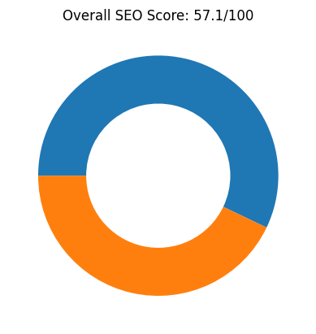
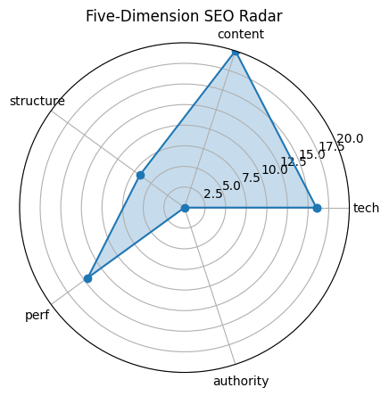

# 🏆 SEO Audit Report – https://y2mate.nu/en-sDNs/

> **扫描时间** 2025-05-21 19:00:49 | **总分** `57.1` / 100  
> 核心结论：The Y2Mate website has moderate SEO performance with significant room for improvement in technical, content, and structural aspects.

---

## 1. 总览

| 维度 | 得分 |
|------|------|
| tech | `16.0` |
| content | `20.0` |
| structure | `6.7` |
| perf | `14.5` |
| authority | `0` |

---

## 2. 技术合规 (20)

| 指标 | 实测 |
|------|------|
| HTTP 状态 | `200` |
| HSTS | `False` |
| CSP | `True` |
| robots.txt | `200` |
| Sitemap | `1` |

---

## 3. 页面内容 (20)

| 指标 | 实测 |
|------|------|
| H1 Count | `1` |
| H2 Count | `0` |
| H3 Count | `0` |
| Missing Alt Images | `0` |
| Text Ratio (%) | `22.98` |

---

## 4. 结构 & 可访问性 (20)

| 指标 | 实测 |
|------|------|
| Internal Links | `11` |
| External Links | `1` |
| Nav Links | `0` |
| Schema Types | `` |

  

---

## 5. 性能 & 体验 (20)

| 指标 | 实测 |
|------|------|
| LCP | `0.84` |
| FID/INP | `862.65` |
| CLS | `0` |
| TTFB | `None` |

---

## 6. 权威 & 语义 (20)

| 指标 | 实测 |
|------|------|
| Structured Data Count | `0` |
| Tech Stack | `` |

---

## 7. 细节

首段正文

`Our YouTube to MP3 Converter allows you to convert your favorite YouTube videos to MP3 (audio) or MP4 (video) files and to download them for FREE.Y2Mateworks on your desktop, tablet and mobile device without the installation of any additional apps. The usage of Y2Mate is free, and safe!`

Quick Tips

- ⚠️ 未检测 canonical

---

## 8. LLM 建议

Improve technical SEO by fixing canonical issues and adding hreflang tags for multilingual support.

Enhance content quality by increasing word count and adding more headings (H2, H3) for better structure.

Boost authority by adding structured data (Schema markup) and social media meta tags.

Optimize performance by ensuring HSTS is enabled and reviewing security headers for best practices.

Expand internal linking strategy and ensure all external links are relevant and high-quality.
